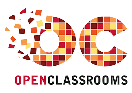

Ce dépôt contient une partie des projets réalisés dans le cadre du parcours de formation *[Data Analyst](https://openclassrooms.com/fr/paths/324-data-analyst)* dispensé par OpenClassrooms.
## &#128295; Outils utilisés
|                   |Projet 10 |Projet 9 |Projet 8 |Projet 7 |Projet 6 |Projet 5 |Projet 4 |Projet 3 |
|:-----------------:|:--------:|:-------:|:-------:|:-------:|:-------:|:-------:|:-------:|:-------:|
|Jupyter Notebook|&#10003;  |&#10003; |         |&#10003; |&#10003; |&#10003; |&#10003; |         |
|Python             |&#10003;  |&#10003; |         |&#10003; |&#10003; |&#10003; |&#10003; |         |
|Numpy              |&#10003;  |&#10003; |         |&#10003; |&#10003; |&#10003; |&#10003; |         |
|Pandas             |&#10003;  |&#10003; |         |&#10003; |&#10003; |&#10003; |&#10003; |         |
|Matplotlib         |&#10003;  |&#10003; |         |         |&#10003; |&#10003; |&#10003; |         |
|Seaborn            |&#10003;  |&#10003; |         |         |         |         |         |         |
|ScyPy              |&#10003;  |&#10003; |         |         |&#10003; |         |         |         |
|scikit-learn       |&#10003;  |&#10003; |         |         |         |         |         |         |
|statsmodels        |&#10003;  |         |         |         |         |         |         |         |
|Knime              |          |         |         |&#10003; |         |         |         |         |
|Power BI           |          |         |&#10003; |         |         |         |         |         |
|SQLite             |          |         |         |         |         |         |         |&#10003; |
|Power Query        |          |         |&#10003; |         |         |         |         |&#10003; |

## [Projet 10 : Détectez des faux billets avec Python](./Détecteur_de_faux_billet/)

### &#127891; Compétences acquises
* Réaliser une régression linéaire.
* Opérer des classifications automatiques pour partitionner les données.
* Réaliser une analyse prédictive.
* Réaliser une régression logistique.
* Réaliser une classification kNN et k-means.
* Réaliser un arbre de décision et une forêt aléatoire.
* Utiliser des méthodes ensemblistes (*Bagging* et *Boosting*).
* Optimiser un modèle avec `GridSearchCV`.
* Valider un modèle avec la validation croisée.

### &#128203; Scénario
En tant que consultant *Data Analyst* nous effectuons une prestation en régie au sein de l’**Organisation nationale de lutte contre le faux-monnayage (ONCFM)**. Cette institution a pour objectif de mettre en place des méthodes d’identification des contrefaçons des billets en euros.

### &#127919; Objectifs
* Préparer et analyser les données comprenant les caractéristiques dimensionnelles des billets en fonction de leur authenticité.
* Explorer différentes solutions pour la mise en place de l'algorithme et retenir le modèle le plus adapté.
* Tester notre algorithme sur de nouvelles données.

## [Projet 9 : Produisez une étude de marché avec Python](./Etude_de_marché/)

### &#127891; Compétences acquises
* Effectuer un clustering simple.
* Explorer des données pour synthétiser des variables.

### &#128203; Scénario
Nous sommes en poste chez **La poule qui chante**, une entreprise française d’agroalimentaire qui souhaite se développer à l'international. Cependant, la liste des pays potentiels dans lesquels s'implanter est longue. Pour cela, nous allons réaliser une analyse des groupements de pays que l'on pourra cibler grâce à différentes méthodes de *clustering*, puis nous approfondirons l'étude de marché.

### &#127919; Objectifs
* Préparer, nettoyer et réaliser une analyse exploratoire dans un *notebook* **Juypter** : 
Les données utilisées sont issues des [statistiques de la *Food and Agriculture Organization of the United Nations (FAO)*](https://www.fao.org/faostat/fr/#home). Elles nous permettront de définir les critères de l'analyse. Ces critères, seront appelés **indicateurs** dans la suite de l'étude.
* Réaliser le *clustering* des pays grâce à la classification ascendante hiérarchique (CAH) et à la méthode des k-means puis réaliser une analyse en composantes principales (ACP) dans un second *notebook*.

## [Projet 8 : Faites une étude sur l'eau potable avec Power BI](./Etude_sur_l'eau_potable/)

### &#127891; Compétences acquises
* Synthétiser des résultats à destination d'un client.
* Créer un tableau de bord répondant à des questions analytiques.
* Analyser un besoin client pour formuler des questions analytiques.
* Générer des graphiques adaptés aux types de données.

### &#128203; Scénario
Consultant Data Analyst en mission dans l’ONG DWFA (Drinking Water For All) ; elle a pour ambition de donner accès à l’eau potable à tout le monde. Le but de cette mission est de réaliser un tableau de bord présentant une vue globale de l’accès à l’eau potable dans le monde. Celui-ci permettra de choisir le pays à cibler pour apporter son aide à ce pays.

### &#127919; Objectifs
Créer un rapport **Power BI** d'au moins 3 pages. Les données sources ont été prétraitées à l'aide de **Power Query**. Il fallait également créer un *blueprint* synthétisant les fontionnalités du rapport ainsi qu'un *mock-up* reprenant le visuel des futures pages en basse définition.

## [Projet 7 : Analysez des indicateurs de l'égalité femme-homme avec Knime](./Analysez_des_indicateurs_de_l_égalité_femme-homme/)

### &#127891; Compétences acquises
* Transférer des données vers une zone de préparation.
* Collecter des données en respectant le RGPD.
* Préparer des données pour l'analyse en respectant les normes internes à l’entreprise.

### &#128203; Scénario
Nous sommes employé, en tant que *Data Analyst*, d'un cabinet de consultant spécialisé dans la transformation digitale des entreprises. Ce dernier compte déjà plus de 150 salariés et est en phase de croissance importante. Il souhaite afficher une politique volontariste pour le développement de l'égalité femme-homme au sein du cabinet.

### &#127919; Objectifs
Automatiser la création d'un rapport de diagnostic sur l'égalité professionnelle à partir des données du Système d’Informations des Ressources Humaines (SIRH) en utilisant le logiciel **Knime**. Il faut créer un *workflow* permettant d'importer et de préparer les données, de générer un fichier CSV (respectant la RGPD) utilisable pour de futures analyses et créer les graphiques des indicateurs du diagnostic.

## [Projet 6 : Analyser les ventes d'une librairie avec Python](./Analysez_les_ventes_d_une_librairie/)

### &#127891; Compétences acquises
* Réaliser un test statistique.
* Réaliser une analyse bivariée pour interpréter des données.
* Analyser des séries temporelles.

### &#128203; Scénario
Nous sommes consultant *Data Analyst* rattaché au service Marketing chez Lapage, une grande librairie généraliste en ligne très réputée. Devant le succès de certains de ses produits et l’engouement de ses clients, elle a décidé d’ouvrir un site de vente en ligne. Nous intervenons car l’entreprise souhaite faire le point après deux ans d’exercice.

### &#127919; Objectifs
Obtenir un jeu de données exploitables à partir des fichiers source, puis réaliser une analyse complète : chiffres clés, KPI, graphiques, etc.. Nous réalisons également plusieurs tests statistiques afin de vérifier la corrélation entre différentes variables liées au profil des clients.

## [Projet 5 : Optimiser la gestion des données d'une boutique](./Optimisez_la_gestion_des_données_d_une_boutique_IKIJ_Ibrahim/)

### &#127891; Compétences acquises
* Gérer les erreurs et les incohérences présentes sur des données stockées.
* Classifier différents types de données.
* Réaliser une analyse univariée pour interpréter des données.

### &#128203; Scénario
Dans le cadre de ce projet, nous sommes *Data Analyst freelance* en mission chez BottleNeck, un marchand de vin très prestigieux.

### &#127919; Objectifs
Obtenir un jeu de données cohérent et complet à partir des fichiers qui nous ont été fournis puis étudier les ventes de la boutique en ligne. Il faudra également réaliser une étude univariée sur les prix de ventes des produits.

## [Projet 4 : Réaliser une étude de santé publique](./Etude_de_santé_publique/)

### &#127891; Compétences acquises
* Rédiger et présenter une méthodologie d'exploration et d'analyse des données.
* Utiliser des librairies spécialisées pour les traitements data.
* Manipuler des DataFrames.

### &#128203; Scénario
Nous intervenons en tant que *Data Analyst* au sein d'une équipe de chercheurs de la *[Food and Agriculture Organization of the United Nations (FAO)](http://www.fao.org/home/fr/)* qui est une agence spécialisée de l'ONU menant des efforts internationaux vers l'élimination de la faim.

### &#127919; Objectifs
Réaliser une étude sur le thème de la sous-nutrition et livrer nos analyses.

## [Projet 3 : Créez et utilisez une base de données immobilière avec SQL](./Créez_et_utilisez_une_base_de_données_immobilière/)
### &#127891; Compétences acquises
* Mettre à jour un catalogue de données.
* Créer des tables dans une base de données.
* Effectuer des requêtes SQL pour répondre à une problématique métier.
* Créer le schéma d'une base de données.
* Charger des données dans une base de données.

### &#128203; Scénario
Nous sommes *Data Analyst* chez Laplace Immo, un réseau national d’agences immobilières. Le directeur général est sensible depuis quelque temps à l’importance des données, et il pense que l’agence doit se démarquer de la concurrence en créant un modèle pour mieux prévoir le prix de vente des biens immobiliers. 

### &#127919; Objectifs
* Créer le dictionnaire des données et le schéma relationnel normalisé.
* Modifier la base de données permettant de collecter les transactions immobilières et foncières en France, puis implémenter cette nouvelle base de données et enfin effectuer les requêtes SQL nécessaires aux analyses.
